# Why was SAPUI5 built?
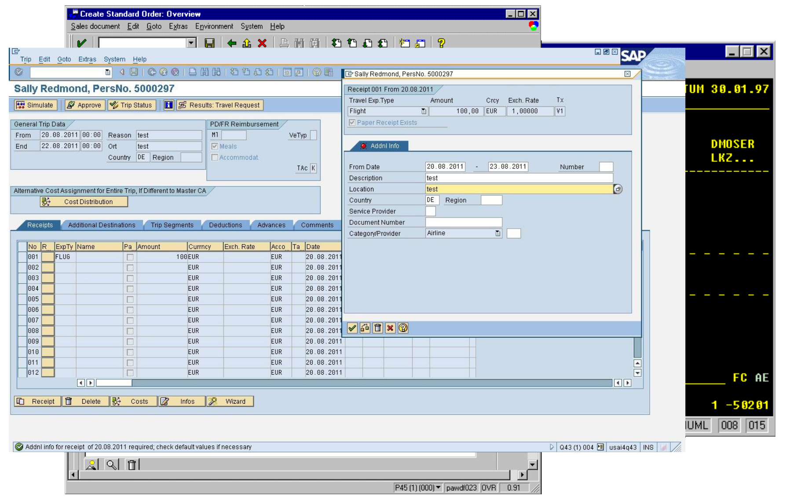
<!-- .slide: data-state="darker5" data-background="images/bg-retro.jpg" -->
Note: Twan

Let me take you on a journey back in time to SAPGUI

# Delightful User Experience
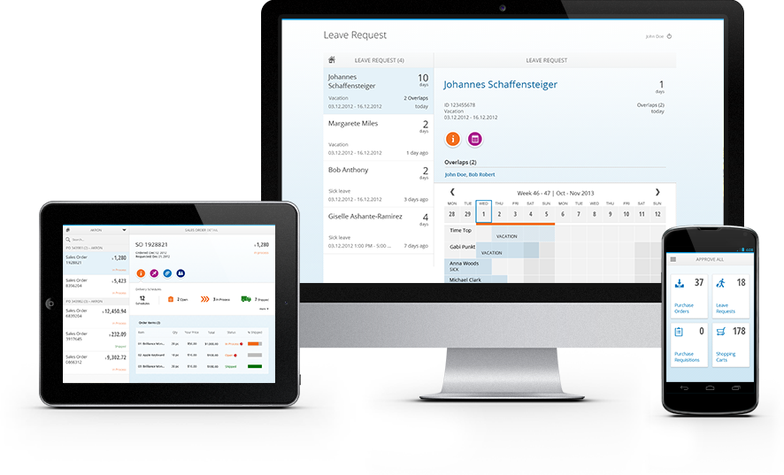
<!-- .slide: data-state="darker7" data-background="images/bg-mobile.jpg" -->
Note: Twan

Responsive, works on every device form factor

#SAPUI5 ➔ OpenUI5
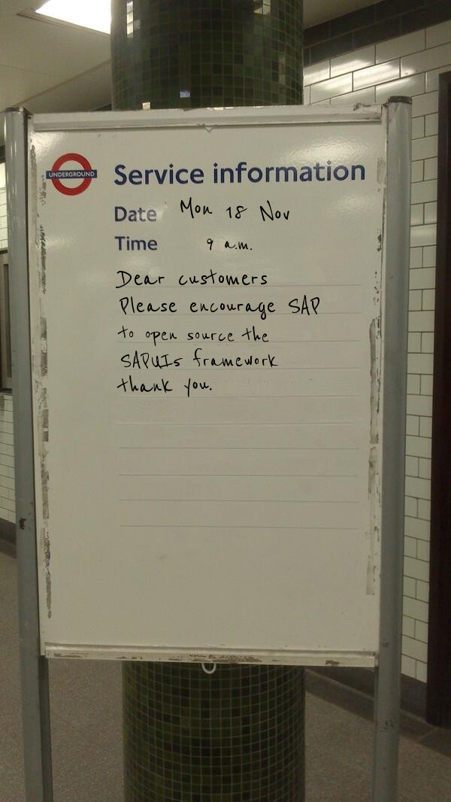
<!-- .slide: data-state="darker7" data-background="images/bg-openui5.jpg" -->
Note: Jan

SAPUI5 was free, but closed

But developers at SAP are open source fans

And the community pushed for it

December 2013: OpenUI5 is born

October 2014: Source is on Github

# OpenUI5 is Open

<!-- .slide: data-state="darker3" data-background="images/bg-open.jpg" -->
Note: Jan

OpenUI5 is an Open Source JavaScript UI framework. OpenUI5 lets you build responsive enterprise-ready web applications.

It’s based on JavaScript and open standards, using JQuery as its foundation

It eases your development with a client-side HTML5 rendering library including a rich set of controls and supports data binding to different models (JSON, XML and OData)."

# Show me some code!
[Click here for OpenUI5 code](http://jsbin.com/pajajot/1/edit?html,output)
Note: Jan
<!-- .slide: data-state="darker7" data-background="images/bg-code.jpg" -->

# Blue horizon
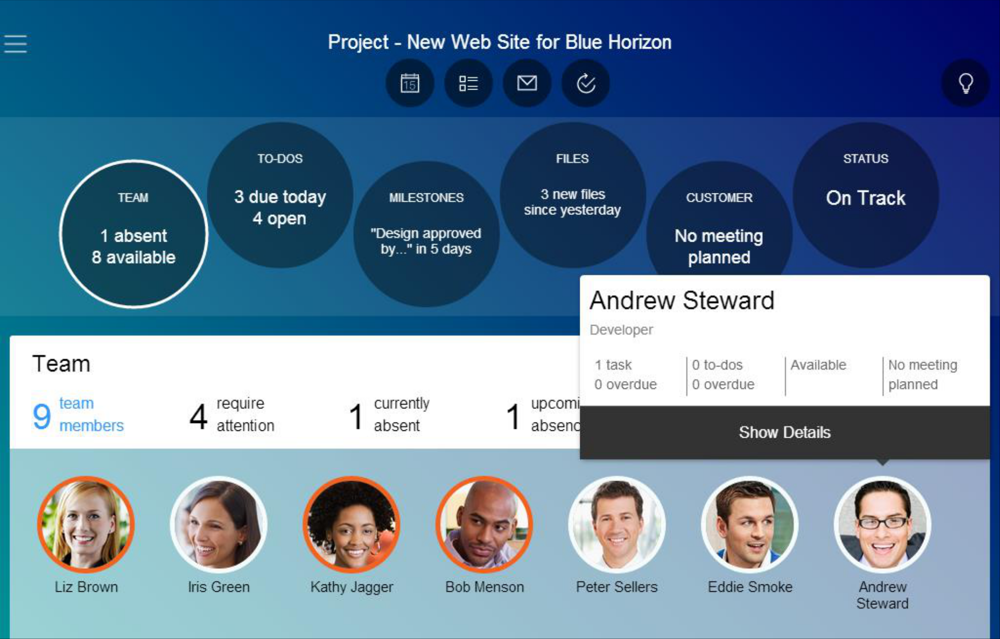
Note: Twan
<!-- .slide: data-state="darker7" data-background="images/bg-bluehorizon.jpg" -->

# Veranda control

Note: Jan
<!-- .slide: data-state="darker5" data-background="images/bg-veranda.jpg" -->

# Suez Nederland
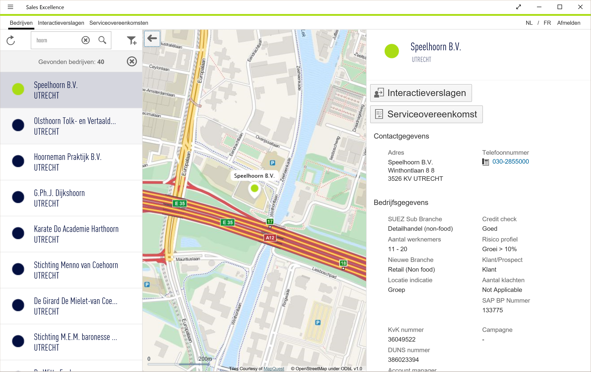
Note: Jan
<!-- .slide: data-state="darker7" data-background="images/bg-suez.jpg" -->

# SAP Sports One
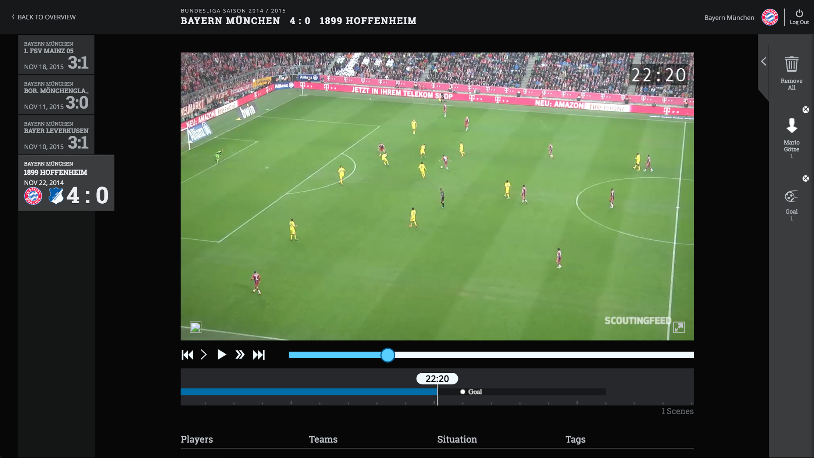
Note: Twan
<!-- .slide: data-state="darker8" data-background="images/bg-sportsone.jpg" -->
[Action!](https://xs02sdccsademo.hana.ondemand.com)

# Theming
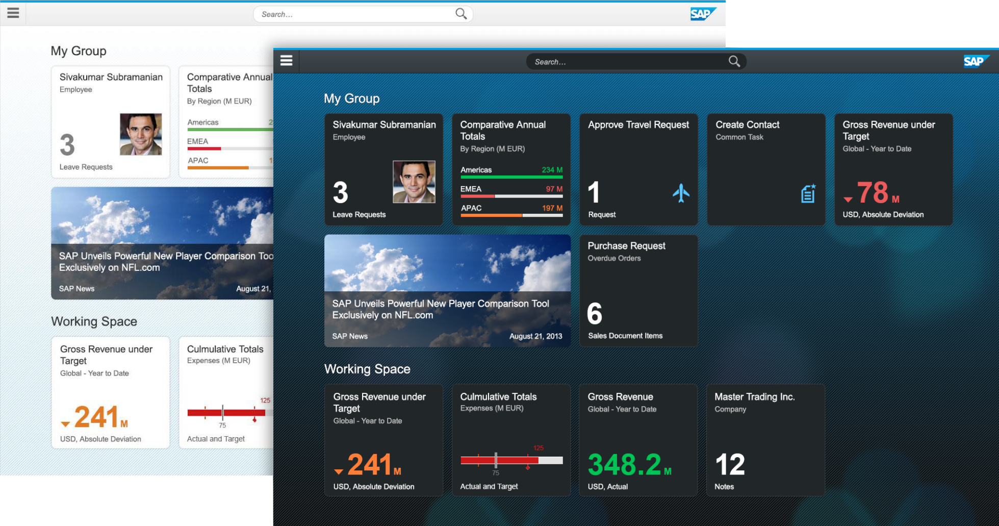
Note: Twan
<!-- .slide: data-state="darker7" data-background="images/bg-theming.jpg" -->

# Custom controls
Controls can be created using JS and OpenUI5 API

Data binding support etc. out of the box

[Try!](http://output.jsbin.com/vukara/5)
<!-- .slide: data-state="darker3" data-background="images/bg-customcontrols.jpg" -->
Note: Jan

After the example: If you build a custom control for a pie-chart missing a slice, a customer control for a ghost, and add some retro game logic, you'll get: Turn to next Slide

# UI5 Pacman!
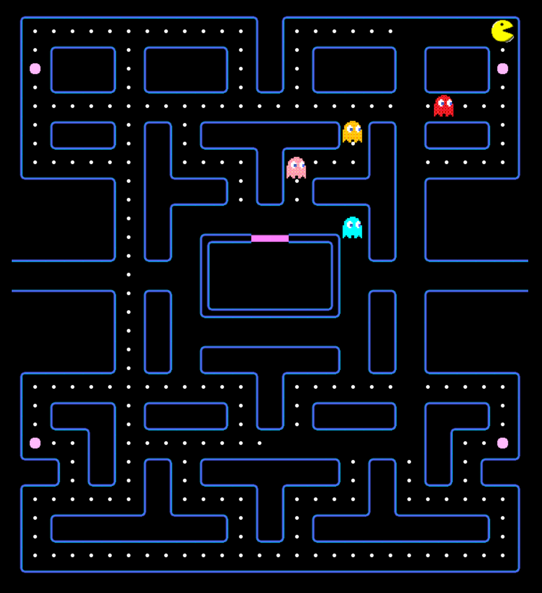 
[Play!](https://pacmanp873115trial.hanatrial.ondemand.com/pacman)
Note: Twan

Everything is a UI5 control. We have class 'Creature' which is a subclass of standard UI5 Control 'Control' and we have Ghost and Pacman being subclasses of 'Creature'

We only have one level map and the ghosts keep getting faster (and PacMan slower) which each level, so nobody can survive more than 2-3 levels.

Game is also playable using USB gamepads

#Enterprise-grade
* Supportability (e.g. Ctrl-Alt-Shift-S popup)
* Internationalization and right-to-left support
* Accessibility
* Extensibility
* Theming
* 250+ UI controls
* MVC, data-binding, templating
Note: Twan
<!-- .slide: data-state="darker5" data-background="images/bg-enterprise.jpg" -->

# Development tooling
* Code completion in various editors:
  * Eclipse (by SAP)
  * Atom (Community)
  * Sublime (Community)
  * WebStorm (Community)
* WebIDE (SAP)
* UI5 Inspector
Note: Jan
<!-- .slide: data-state="darker3" data-background="images/bg-tooling.jpg" -->

# WebIDE Demo
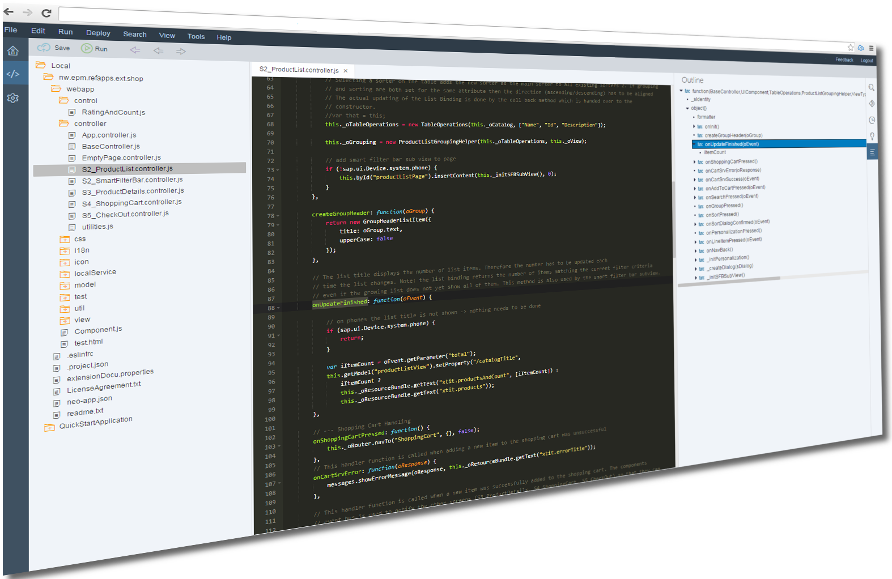 
[Demo](https://webide-p508741trial.dispatcher.hanatrial.ondemand.com/?hc_reset)
Note: Jan
<!-- .slide: data-state="darker5" data-background="images/bg-webide.jpg" -->

# UI5 Inspector (for Chrome)
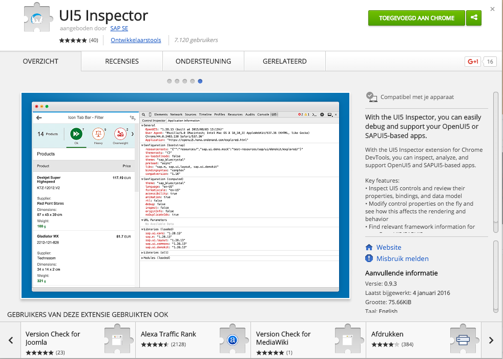
Note: Jan
<!-- .slide: data-state="darker2" data-background="images/bg-debugging.png" -->

# Who uses UI5?
* Danone
* SAS
* Adidas
* National Center for Tumor Diseases
* TÜV Rheinland
* Colgate-Palmolive
* Nestlé
* Novartis
* Shell
* Unilever

Note: Twan

Danone using UI5 and the SAP Hana Cloud Platform, e.g. for a CRM Call Center in South Africa and the Nutricia Metabolics Web Shop

SAS decided to do "all of their new web application development with OpenUI5"

Adidas has reported about its usage of UI5 in its dealer portal

National Center for Tumor Diseases developed a UI5-based app called "Medical Research Insights". This product won the "German Design Award 2015" in the category "Excellent Communications Design"

TÜV Rheinland, a global provider of technical, safety, and certification services, gave this presentation about the UI5-based implementation of their customer portal, at the DSAG Jahreskongress 2015 conference. Their bottom line was that "SAPUI5 is very flexible and the design can be adapted well [...] custom Fiori apps can be implemented without big effort".

Colgate-Palmolive reported about their implementation of UI5-based SAP Fiori in this video, mentioning the fact that the UI is "extremely easy to use" and talking about "very positive feedback" regarding usability and performance.

Nestlé has been reported by SAP insider (Volume 15, Issue 2) as using 18 SAP Fiori applications built with UI5, and to be rolling out these apps to around 18,000 users. They report that the 500 test users "have been very positive about using SAP Fiori".

Novartis has rolled out UI5-based Fiori applications to 130,000 end users in 2014.

Shell has been announced in an SAP News article as also moving towards using SAP Fiori.

Unilever talks about user experience design in general and also mentions UI5-powered SAP Fiori as an answer to the usability challenge in this video.
<!-- .slide: data-state="darker5" data-background="images/bg-unilever.jpg" -->

# OpenUI5 MOOC
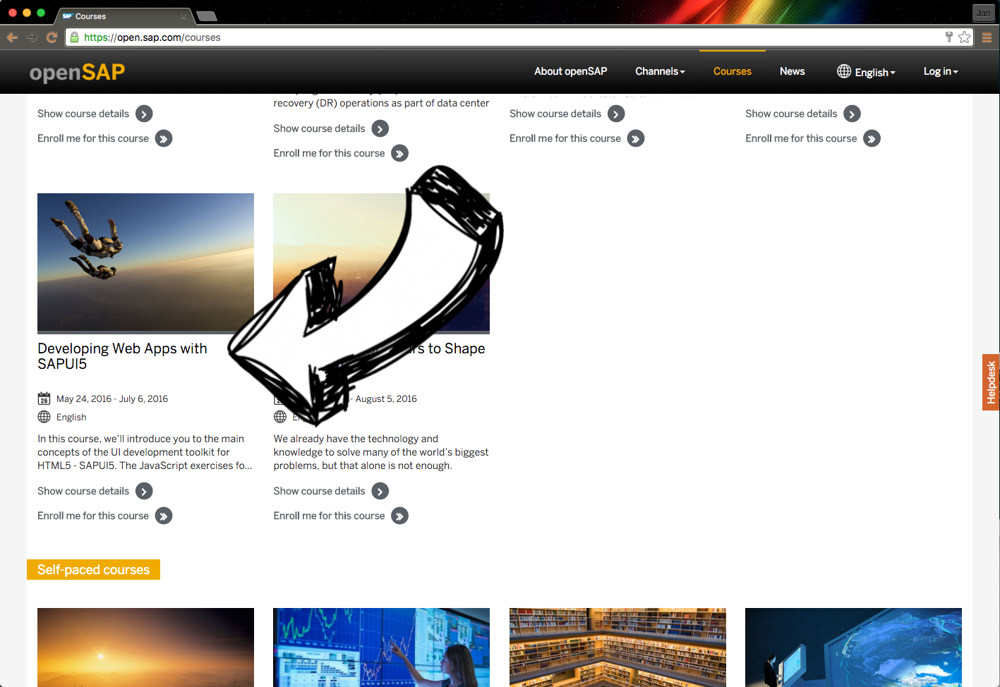
Note: Jan
<!-- .slide: data-state="darker2" data-background="images/bg-opensap.png" -->
